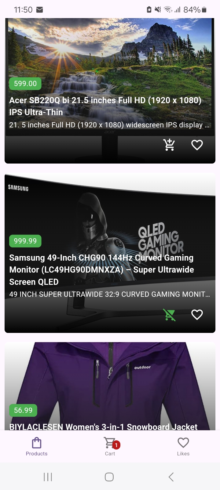
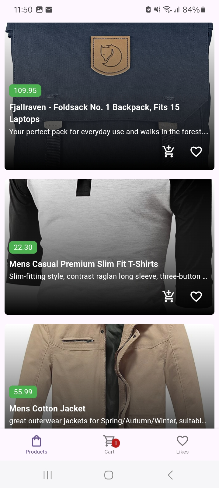
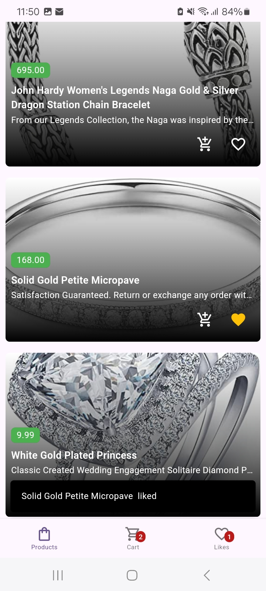
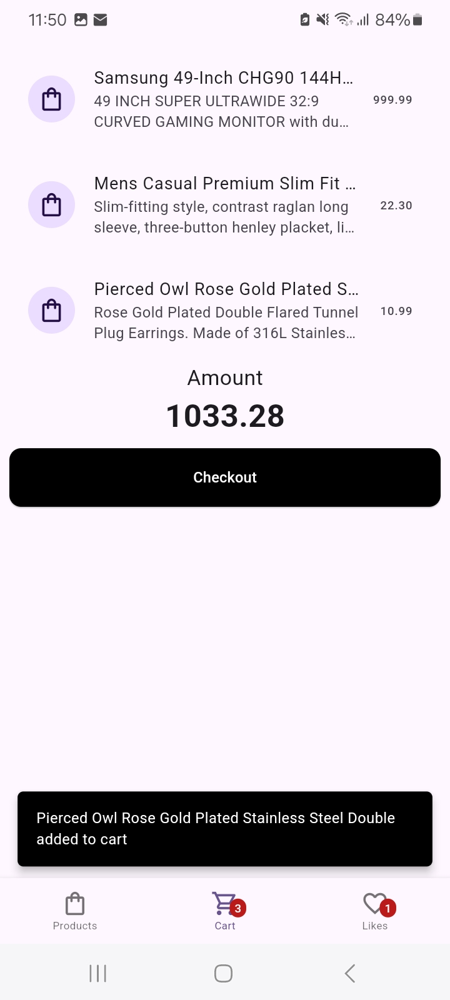
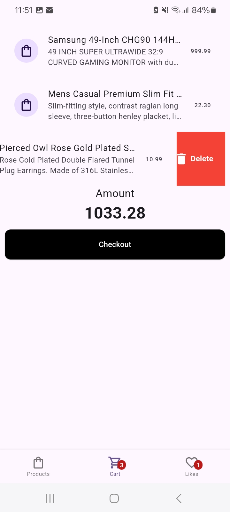

# Products Ecommerce Application

The application allows users to
browse products, view product details, and add products to a shopping cart.

API used: `https://fakestoreapi.com/`
Riverpod used for state management

## Screenshots

 

## Installation (Requires Flutter)

Connect an Android devie and run the following commands
`flutter pub get`
`flutter build apk --release`
`flutter install`

Prebuilt apk also available at [Google Drive Link](https://drive.google.com/file/d/1he7ygwYz50eVzy8ZDi6o3mnKZBtKSEOq/view?usp=sharing)
