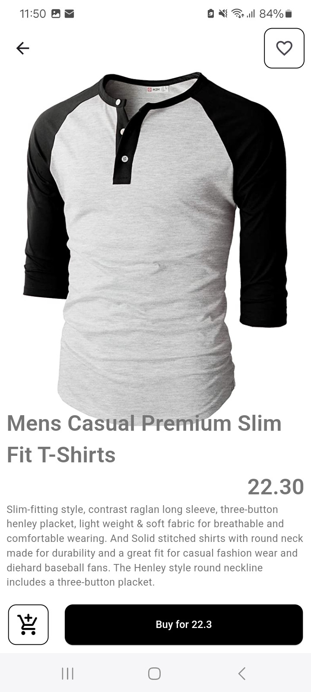

# Products Ecommerce Application

The application allows users to
browse products, view product details, and add products to a shopping cart.

API used: `https://fakestoreapi.com/`
Riverpod used for state management

## Screenshots

 

